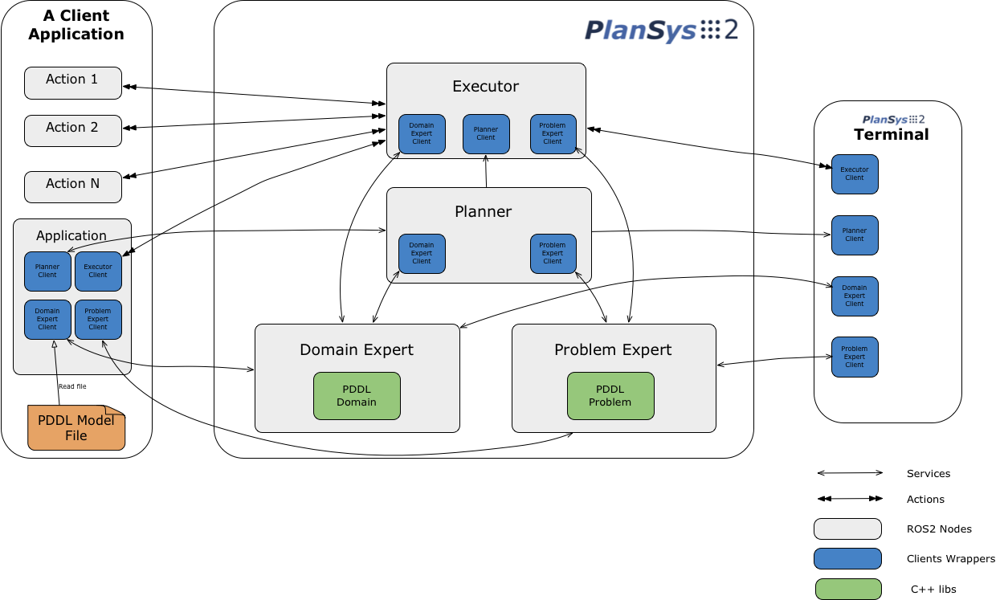

[](https://github.com/IntelligentRoboticsLabs/ros2_planning_system)
[](https://codecov.io/gh/IntelligentRoboticsLabs/ros2_planning_system)

ROS2 Planning System (**plansys2** in short) is a project whose objective is to provide Robotics developers with a reliable, simple, and efficient PDDL-based planning system. It is implemented in ROS2, applying the latest concepts developed in this currently de-facto standard in Robotics.

This project is the result of several years of experience in the development of robotic behaviors using [ROSPlan](https://github.com/KCL-Planning/ROSPlan). ROSPlan has greatly inspired this project. In addition to the migration to ROS2, we contribute to key aspects: ease of use, efficiency, and new tools, such as our terminal.

We hope that this software helps to include planning in more Robotics projects, offering simple and powerful software to generate intelligent behaviors for robots.

We want to invite you to contribute to this Open Source project !!

# Design



4 ROS2 nodes compose Plansys2:
- **Domain Expert**: Contains the PDDL model information (types, predicates model, and actions). It is static and can be queried using services or a Domain Expert Client, that hides the ROS2 services complexity.
- **Problem Expert**: Contains the current instances, predicates, and goals that compose the model. It is dynamic and volatile. It can be queried/modified using services or a Problem Expert Client, that hides the ROS2 services complexity. It uses a topic (`std_msgs::msg::Empty`) to notify when it changes. 
- **Planner**: Generates plans (sequence of actions) using the information contained in the Domain and Problem Experts.
- **Executor**: Takes a plan and executes it by calling (using actions) the ROS2 nodes that implement each action. It verifies that requirements are accomplished during execution.

The **Terminal** is a plansys2 util for operating with the above components. 

To make an application using plansys2, you must provide a PDDL model, the implementation of the actions in this model, and an application in charge of setting the starting instances and predicates. It can set goals and call to the executor to achieve these goals. Actions are easy to develop using the `ActionExecutorClient` class. 

Another exciting feature of Plansys2 is the possibility of having several instances of Plansys2 running independently at the same time, in different namespaces. Each instance of Plansys2 can run different PDDL models. This feature lets you have independent or hierarchical planning in the same application.

# Requirements and compilation

This project was initially developed for ROS2 Eloquent. In addition to official packages, plansys2 requires popf, a PDDL plan solver, developed by Marc Hanheide, to which we have contributed to its migration to a ROS2 package.

Before compiling, install popf and include cascade_lifecycle in your workspace (or install from deb packages when available):

```
plansys2_ws/src$ sudo apt-get install ros-foxy-popf
plansys2_ws/src$ git clone http://github.com/fmrico/cascade_lifecycle.git
```

Next, only compile:

```
plansys2_ws$ colcon build --symlink-install

```

# Example

In this [example](https://github.com/IntelligentRoboticsLabs/ros2_planning_system_examples/tree/master/plansys2_patrol_navigation_example), the robot make plans to patrol some waypoints:

[](https://www.youtube.com/watch?v=fAEGySqefwo)

# ROS Planning System in ROSDevDay2020

[](https://www.youtube.com/watch?v=nLp4uzN5NMs&t=12364s)

# Further readings

- PDDL basics [1](https://arxiv.org/pdf/1106.4561.pdf), [2](http://www.cs.toronto.edu/~sheila/2542/w09/A1/introtopddl2.pdf) and [3](http://www.cs.toronto.edu/~sheila/384/w11/Assignments/A3/veloso-PDDL_by_Example.pdf)
- [Developers Guide](plansys2_docs/developer_guide.md)
- [Tutorials](plansys2_docs/tutorials.md)
- [FAQ](plansys2_docs/FAQ.md)


