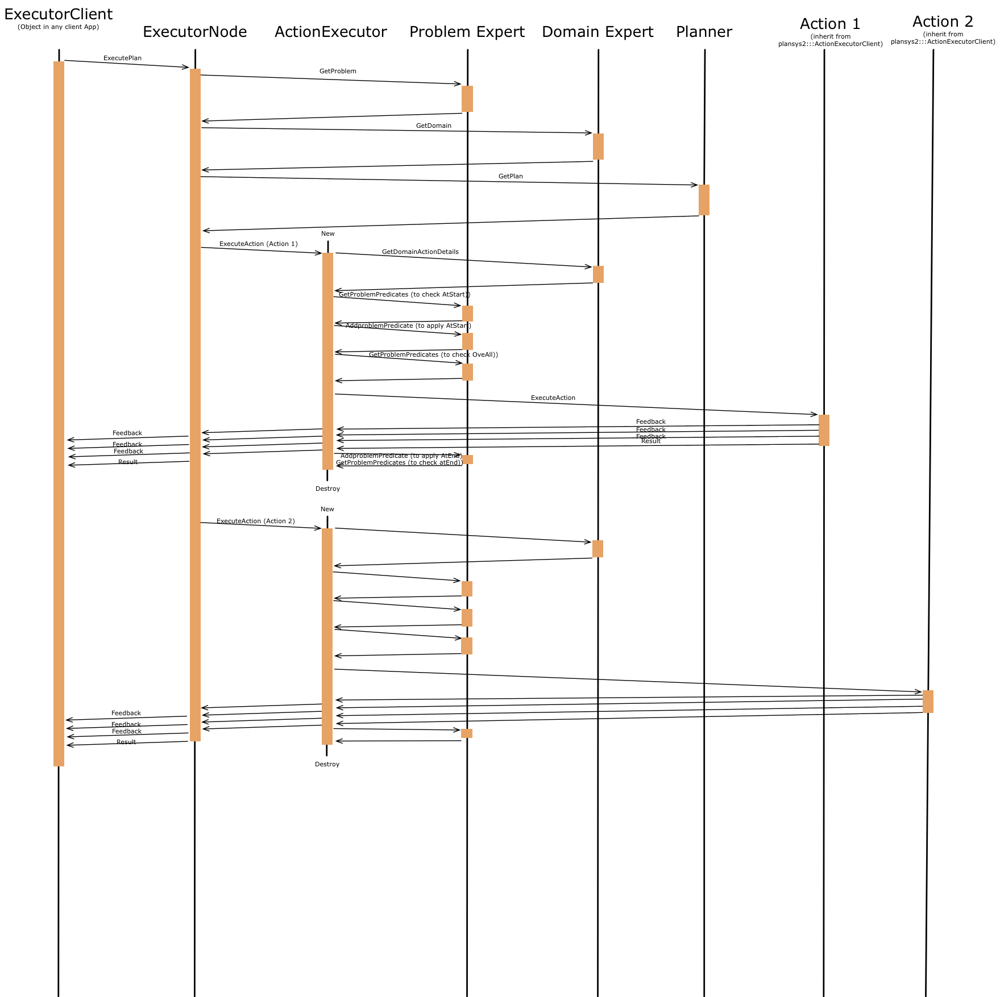

# Executor

The Executor module is responsible for requesting a plan to the Planner, and carry it out, calling to the nodes in the client application that implements the actions. While executing each action, it checks the requisites (*At Start, At End and Over all*, in case of durative Actions). If the requirements are not meet, it cancels the plan execution. It also is responsible for applying the effects of the actions, requesting updates to the Problem Expert.

The main class of Executor is [`plansys2::ExecutorNode`](include/include/plansys2_executor/ExcutorNode.hpp), which is instantiated from [`executor_node.cpp`](src/executor_node.cpp). 

The executions of plans are carried out using ROS2 actions, in particular, [`plansys2_msgs::action::ExecutePlan`](../plansys2_msgs/action/ExecutePlan.action). Take note that the goal must be already in the Domain Expert. 

ExecutorNode ask for the domain and problem, and ask for a plan to the Planner. For each action in the plan, ExecuterNode creates a [`plansys2::ActionExecutor`](include/include/plansys2_executor/ActionExecutor.hpp). The lifetime of this object is only one action. This object calls the actions implemented in the client appliciation using the ROS2 actions [`plansys2_msgs::action::ExecuteAction`](../plansys2_msgs/action/ExecuteAction.action). Each client action implementation can use the class [`plansys2::ActionExecutorClient`](include/include/plansys2_executor/ActionExecutorClient.hpp) to avoid the complexity of managing ROS2 actions.

Using the feedback information from `plansys2_msgs::action::ExecuteAction`, feedback for `plansys2::ExecutorNode` is composed and returned to `plansys2::ExecutorClient`. It contains the current action in the plan and the progress in the currently executing action.

Next graph shows an example of the execution flow:




## Actions:

- `/execute_plan` [[`plansys2_msgs::action::ExecutePlan`](../plansys2_msgs/action/ExecutePlan.action)]

(in ActionExecutorClient)

- `/${ACTION_NAME`}[[`plansys2_msgs::action::ExecuteAction`](../plansys2_msgs/action/ExecuteAction.action)]

## Services:

- `/executor/get_ordered_sub_goals` [[`plansys2_msgs::srv::GetOrderedSubGoals`](../plansys2_msgs/srv/GetOrderedSubGoals.srv)]

## Subscribed topics:

(in ActionExecutor)

- `/problem_expert/update_notify` [`std_msgs::msg::Empty`]

## Parameters:

(in ExecutorNode)

- `~/action_timeouts/actions` [`list of strings`]

  - List of actions which have duration overrun percentages specified.

- `~/action_timeouts/[ACTION_NAME]/duration_overrun_percentage` [`double`]

  - Defines the allowable time overrun of an action based on a percentage of the predicted plan duration.
    For example, if the plan predicts that an action should take 1000 secs and a duration overrun percentage of
    20% is specified, then the action should be halted if the actual duration exceeds 1200 secs.

```yaml
executor:
  ros__parameters:
    action_timeouts:
      actions: ["move"]
      move:
        duration_overrun_percentage: 20.0
```
